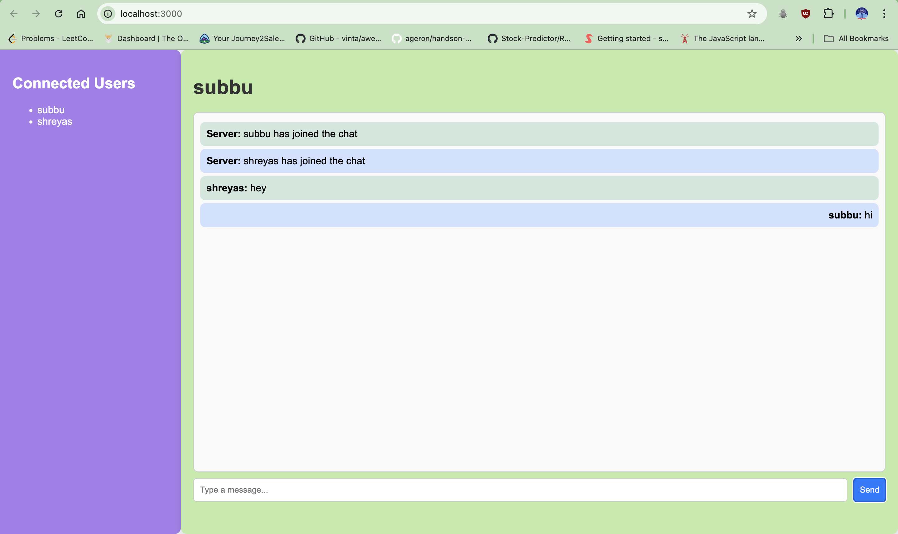

# Real-Time Chat Application

A real-time chat application built using **Node.js**, **Express**, and **Socket.io**. This application allows users to join a chat room, see who is currently online, and send messages in real time. 

## Features

- **Real-Time Messaging**: Users can send and receive messages instantly.
- **User List**: New users can see all previously connected users (who haven't disconnected) when they join.
- **Notifications**: Users receive notifications for new messages.
- **User Activity Status**: Displays the current online status of users.
- **Modern UI**: A visually appealing user interface for an enhanced chat experience.

## Tech Stack

- **Backend**: Node.js, Express
- **Real-Time Communication**: Socket.io
- **Frontend**: HTML, CSS, JavaScript

## Getting Started

### Prerequisites

- [Node.js](https://nodejs.org/) (v14 or later)
- [npm](https://www.npmjs.com/) (Node package manager)

### Installation

1. **Clone the repository**:

   ```bash
   git clone <repository-url>
   cd real-time-chat
   ```

2. **Install dependencies**:

   ```bash
   npm install
   ```

### Running the Application

1. **Start the server**:

   ```bash
   node app.js
   ```

2. **Open your browser** and go to `http://localhost:3000` to access the chat application.

### Usage

- Upon accessing the application, enter a username to join the chat room.
- Users can send messages, and the chat interface will display them in real time.
- The user list on the left shows all currently connected users.

## Deployment(optional)

To deploy this application on an AWS EC2 instance, follow these steps:

1. Launch an EC2 instance and connect via SSH.
2. Install Node.js and other required dependencies.
3. Upload your application files using `scp` or clone your repository.
4. Run the application using Node.js or a process manager like `pm2` to keep it running.

## Contributing

If you want to contribute to this project, feel free to submit a pull request or open an issue.
things to be build 
A DB to store messages
DMs
Profiles
Auth preferably firebase 

## License

This project is licensed under the MIT License - see the [LICENSE](LICENSE) file for details.

## Author

**Subramanya T N**  
Bangalore, India  
[Your LinkedIn Profile](https://www.linkedin.com/in/subramanya-tn-b399011a8/)
