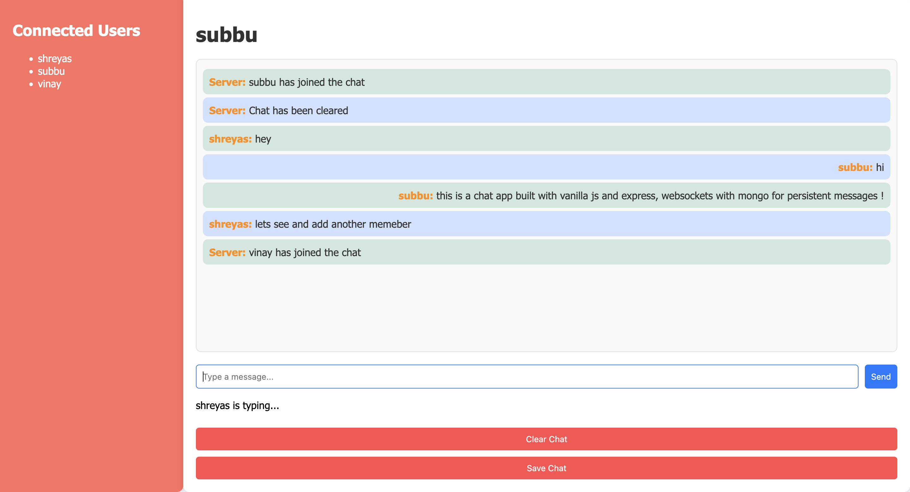
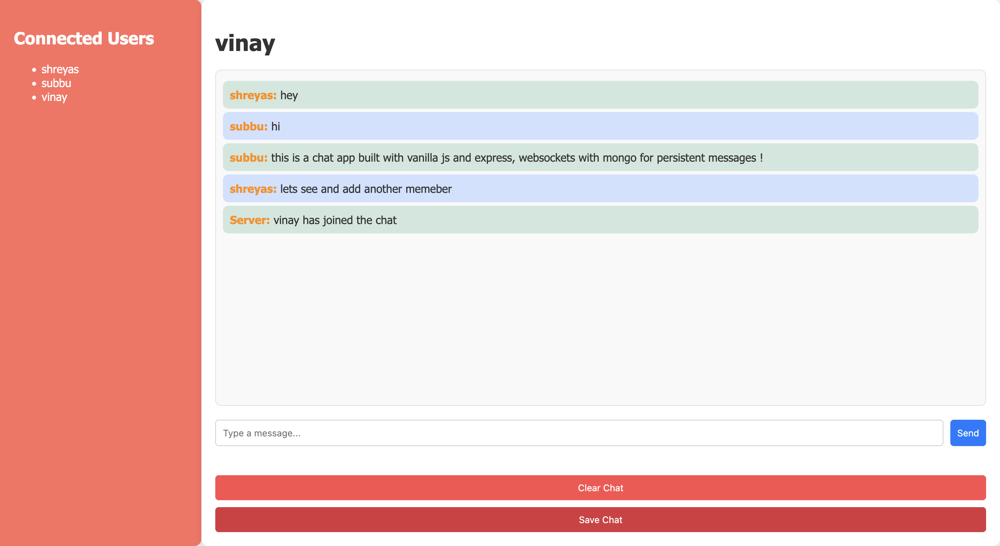
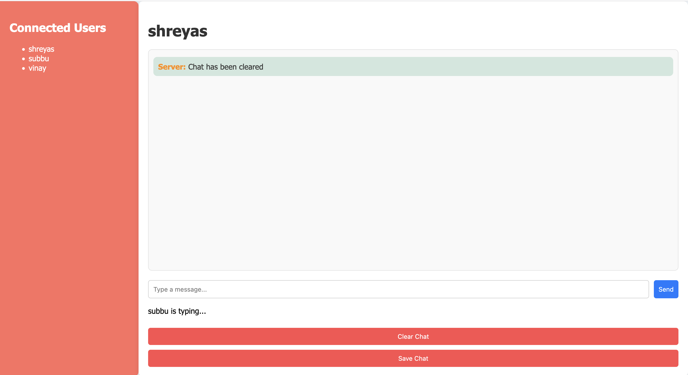

# Real-Time Chat Application with Persistent Messaging

## Features

- **Real-Time Messaging**: Users can send and receive messages instantly.
  

- **Persistent Messaging**: Messages are stored in a database and are available when users reconnect.
  

- **User Activity Status**: Displays the current online status of users.
  

- **Saving Messages to Text**: Users can save chat messages to a text file.
  

- **Deleting Messages**: Users can delete all chat messages.
  

## Tech Stack

- **Backend**: Node.js, Express
- **Real-Time Communication**: Socket.io
- **Database**: MongoDB for persistent messaging
- **Frontend**: HTML, CSS, JavaScript

## MongoDB Integration

This application uses MongoDB to store chat messages persistently. Ensure you have a MongoDB instance running and accessible.

### Updating the MongoDB URL

1. Open the `.env` file located in the root of the project.
2. Update the `MONGO_URL` variable with your MongoDB connection string:

   ```plaintext
   MONGO_URL=mongodb+srv://<username>:<password>@cluster0.mongodb.net/myFirstDatabase?retryWrites=true&w=majority
